# Laporan Modul 2: Dasar Pemrograman Java
*Mata Kuliah:* Praktikum Pemrograman Berorientasi Objek   
*Nama:* Siti Azzahra  
*NIM:* 2024573010046  
*Kelas:* TI - 2E

---

## 1. Abstrak
Tuliskan ringkasan singkat tentang isi laporan ini dan tujuan Anda membuat laporan.

---
## 2. Praktikum
### Praktikum 1 - Variabel dan Tipe Data
#### Dasar Teori

#### Langkah Praktikum
1. buatlah file baru dengan nama VariabelDemo.java
2. ketik kode berikut
   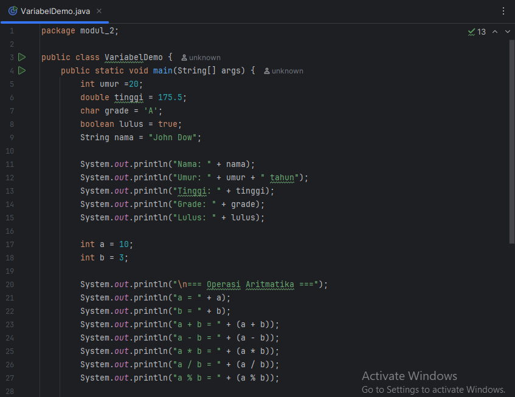
   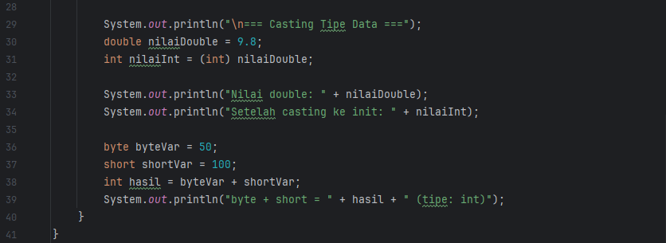

#### Screenshoot Hasil
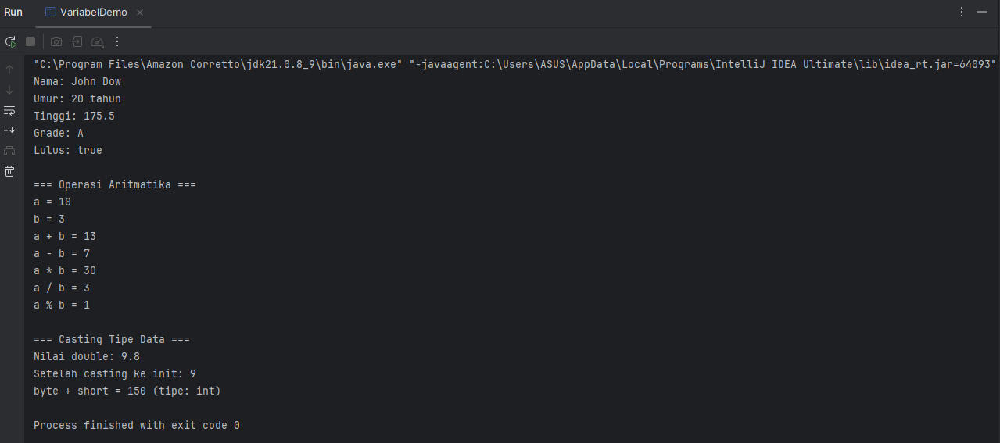

#### Analisa dan Pembahasan
Program diatas membuat deklarasi dan inisialisasi variabel dengan berbagai tipe data.
Diantaranya int umur, double tinggi, char grade, boolean lulus, string nama. Kemudian menampilkan
nilai variabel string dengan menggunakan operator + untuk menggabungkan isi variabel dengan string.

Kemudian terdapat penggunaan operasi aritmatika setelah mendeklarasi dan menginisialisasi variabel a dan b dengan tipe data intiger.
kemudian program meminta menampilkan proses aritmatika dengan operator +, -, *, /, %.

proses casting yaitu proses untuk mengubah tipe data asal ke tipe data lain. Dalam baris program dikatas Tipe data awal ialah double dengan nilai 9.8
kemudian dilakukan casting ke int dalam baris int nilaiInt = (int) nilaidouble.

Proses menjumlahkan byte dan short var
### Praktikum 2 - Input, Output, Dan Scanner
#### Dasar Teori
Untuk membaca input dari pengguna dalam Java, kita menggunakan class Scanner yang terdapat dalam package java.util.
Scanner menyediakan berbagai method untuk membaca berbagai tipe data:
* nextInt() : membaca integer
* nextDouble() : Membaca Double
* nextLine() : membaca string (termasuk spasi)
* next() : membaca string (samoai spasi pertama)
* nextBoolean() : membaca boolean

#### Langkah Praktikum
langkah 1, mengimport dan membuat scanner
1. buat file baru InputOutputDemo.java
2. ketik kode berikut ini
   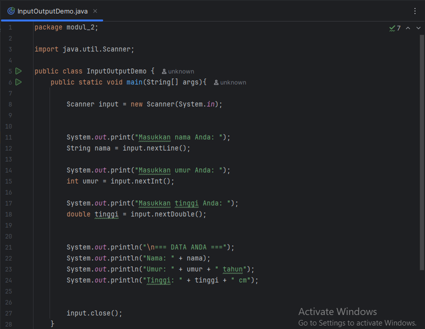
#### Screenshoot Hasil
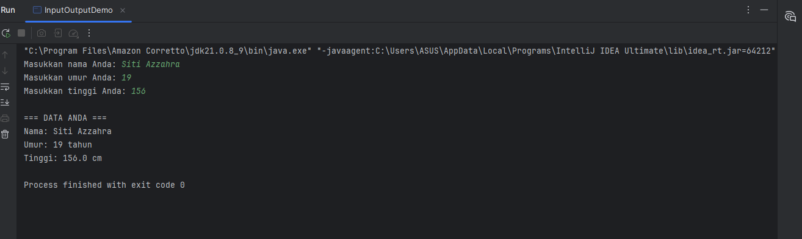
#### Analisa dan Pembahasan
Program InputOutputDemo merupakan contoh sederhana penggunaan input dan output pada bahasa pemrograman Java. Program ini menggunakan class Scanner untuk membaca data yang dimasukkan oleh pengguna melalui keyboard.
Pertama, program meminta pengguna untuk memasukkan nama, umur, dan tinggi badan. Data yang dimasukkan kemudian disimpan dalam variabel dengan tipe data yang sesuai, yaitu String untuk nama, int untuk umur, dan double untuk tinggi badan. Pemilihan tipe data ini sudah tepat karena disesuaikan dengan karakteristik data yang diminta.
Setelah data diterima, program menampilkan kembali informasi tersebut kepada pengguna dengan format yang sederhana. Output diawali dengan judul "DATA ANDA", kemudian diikuti oleh detail nama, umur, dan tinggi yang sudah diinput. Dengan cara ini, pengguna dapat melihat kembali data yang telah dimasukkan.
Dari sisi pengelolaan sumber daya, program sudah menutup objek Scanner setelah selesai digunakan. Hal ini merupakan praktik pemrograman yang baik karena dapat mencegah kebocoran memori.

adapun kelebihan dari program ini adalah strukturnya jelas, mudah dipahami, serta mampu membaca berbagai jenis data (teks, bilangan bulat, dan bilangan desimal). Selain itu, penggunaan Scanner juga sudah sesuai dengan aturan standar Java.
Namun, terdapat beberapa kekurangan. Program belum dilengkapi dengan validasi input, sehingga jika pengguna salah memasukkan format data (misalnya mengetik huruf pada bagian umur), program akan mengalami error. Selain itu, tampilan output masih sederhana sehingga kurang interaktif jika diterapkan pada aplikasi yang lebih kompleks.
Secara keseluruhan, program ini sudah baik sebagai latihan dasar untuk memahami konsep input dan output pada Java. Program mampu menunjukkan bagaimana cara menerima data dari pengguna, menyimpannya ke dalam variabel, lalu menampilkannya kembali. Meskipun sederhana, program ini menjadi pondasi penting untuk pengembangan aplikasi yang lebih kompleks di masa depan.

### Praktikum 3 - Struktur Control:Percabangan
#### Dasar Teori
Struktur kontrol percabangan digunakan untuk membuat keputusan dalam program. Java menyediakan beberapa statement percabangan:
#### Langkah Praktikum
langkah 1: program penentu grade
1. buat file dengan nama GradeDemo.java
2. implementasi kode berikut
   
   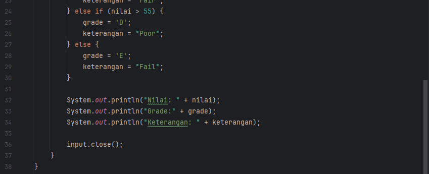
#### Screenshoot Hasil
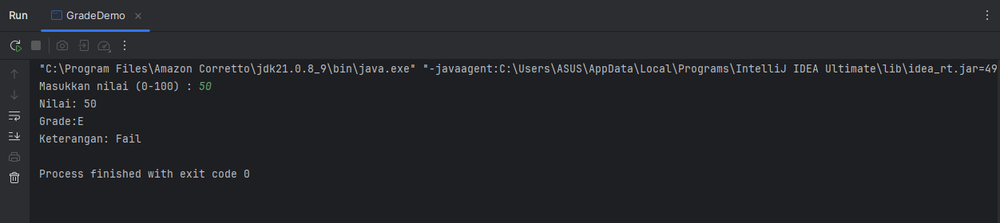
#### Analisa dan Pembahasan
Program GradeDemo adalah sebuah program sederhana dalam bahasa Java yang digunakan untuk menentukan nilai huruf (grade) dan keterangan dari sebuah nilai numerik. Program ini menggunakan class Scanner untuk membaca input berupa nilai angka dari pengguna.
Pertama, program meminta pengguna untuk memasukkan sebuah nilai dengan rentang 0–100. Nilai tersebut disimpan dalam variabel bertipe int. Setelah itu, program menggunakan struktur if-else if-else untuk menentukan grade dan keterangan berdasarkan nilai yang dimasukkan.

Logika penentuan grade pada program adalah sebagai berikut:
-Nilai lebih dari 85 mendapat grade A dengan keterangan Excellent.
-Nilai lebih dari 75 sampai 85 mendapat grade B dengan keterangan Good.
-Nilai lebih dari 65 sampai 75 mendapat grade C dengan keterangan Fair.
-Nilai lebih dari 55 sampai 65 mendapat grade D dengan keterangan Poor.
-Nilai 55 ke bawah mendapat grade E dengan keterangan Fail.

Setelah proses penentuan selesai, program menampilkan hasil berupa nilai angka, grade, dan keterangan kepada pengguna. Output ini membantu pengguna untuk mengetahui klasifikasi dari nilai yang telah dimasukkan.
Kelebihan dari program ini adalah logika yang sederhana dan mudah dipahami, serta mampu mengelompokkan nilai ke dalam kategori dengan jelas. Program ini juga sudah menutup objek Scanner setelah digunakan, sehingga mengikuti praktik pemrograman yang baik.
Namun, ada beberapa kekurangan. Program belum memiliki validasi input, sehingga jika pengguna memasukkan nilai di luar rentang 0–100 atau memasukkan karakter non-angka, program akan mengalami error. Selain itu, tampilan output masih sederhana dan dapat diperindah dengan format yang lebih rapi agar lebih user-friendly.

Secara keseluruhan, program GradeDemo berhasil menunjukkan cara penggunaan struktur kontrol if-else untuk pengambilan keputusan. Program ini sangat berguna sebagai latihan dasar dalam memahami logika percabangan pada Java.

langkah 2 : program menu dengan switch
1. buat file baru dengan nama MenuDemo.java
2. implementasikan kode tersebut
   
   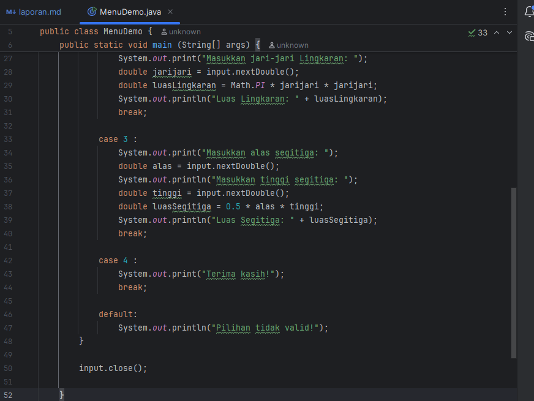
#### Screenshoot Hasil
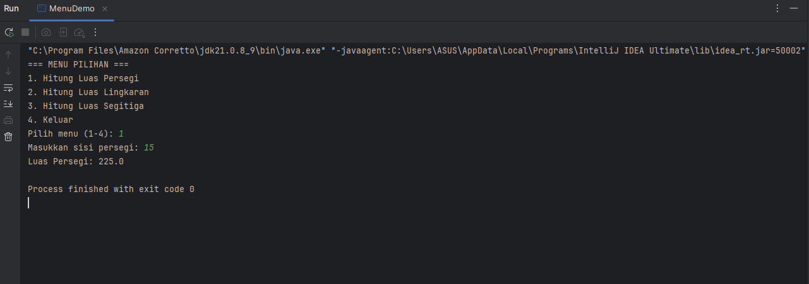
#### Analisa dan Pembahasan
Program MenuDemo adalah contoh penerapan struktur kontrol switch-case pada bahasa Java yang digunakan untuk membuat sebuah menu interaktif. Program ini meminta pengguna memilih salah satu dari beberapa opsi perhitungan luas bangun datar, yaitu persegi, lingkaran, segitiga, atau keluar dari program.
Pertama, program menampilkan daftar menu pilihan. Pengguna diminta untuk memasukkan angka antara 1 sampai 4 sebagai input. Input tersebut kemudian diproses menggunakan struktur kontrol switch.
Rincian logika dari setiap pilihan adalah sebagai berikut:

Hitung Luas Persegi:
Program meminta pengguna memasukkan panjang sisi persegi.
Luas dihitung dengan rumus sisi × sisi.
Hasil perhitungan ditampilkan di layar.

Hitung Luas Lingkaran:
Program meminta pengguna memasukkan jari-jari lingkaran.
Luas dihitung dengan rumus π × r × r.
Program menggunakan konstanta Math.PI sebagai nilai π untuk memastikan hasil lebih akurat.

Hitung Luas Segitiga:
Program meminta pengguna memasukkan alas dan tinggi segitiga.
Luas dihitung dengan rumus ½ × alas × tinggi.
Hasil luas segitiga ditampilkan di layar.

Keluar
Jika pengguna memilih angka 4, program menampilkan pesan "Terima kasih!" dan berhenti.
Jika pengguna memasukkan angka di luar rentang 1–4, maka program akan menampilkan pesan "Pilihan tidak valid!".

Kelebihan Program
-Menggunakan switch-case, sehingga logika pemilihan menu lebih terstruktur dan mudah dipahami.
-Menerapkan rumus matematika dasar dengan benar untuk menghitung luas bangun datar.
-Sudah menutup objek Scanner setelah digunakan, yang merupakan praktik pemrograman yang baik.

Kekurangan Program
-Belum ada validasi input jika pengguna memasukkan huruf atau simbol selain angka, program akan error.
-Tampilan menu masih sederhana, sehingga kurang interaktif jika diterapkan pada aplikasi nyata.
-Program hanya bisa menghitung sekali, setelah selesai pengguna tidak dapat kembali ke menu utama tanpa menjalankan ulang program.

Kesimpulan
Program MenuDemo berhasil menunjukkan cara penggunaan struktur kontrol switch-case untuk membuat menu interaktif. Program ini juga memperlihatkan penerapan rumus perhitungan luas pada beberapa bangun datar. Meskipun masih sederhana, program ini sudah cukup baik sebagai latihan untuk memahami konsep percabangan dan interaksi pengguna dalam bahasa Java.

langkah 3 : program nested if
1. buatlah file baru dengan nama NestedIfDemo.java
2. implementasi kode berikut
   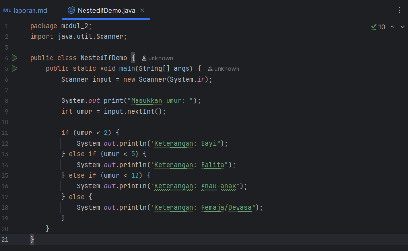
#### Screenshoot Hasil
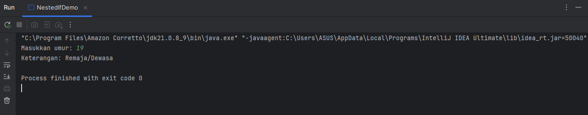
#### Analisa dan Pembahasan
Program NestedIfDemo merupakan program sederhana dalam bahasa Java yang menggunakan struktur kontrol if-else if-else untuk mengklasifikasikan umur seseorang ke dalam kategori tertentu. Program ini memanfaatkan class Scanner untuk membaca input umur dari pengguna.
Pertama, program meminta pengguna memasukkan umur dalam bentuk bilangan bulat. Setelah nilai umur diperoleh, program memeriksa kondisi umur dengan menggunakan beberapa blok percabangan.

Rincian logika dari percabangan adalah sebagai berikut:
Jika umur kurang dari 2 tahun, maka ditampilkan keterangan Bayi.
Jika umur kurang dari 5 tahun tetapi lebih dari atau sama dengan 2, maka ditampilkan keterangan Balita.
Jika umur kurang dari 12 tahun tetapi lebih dari atau sama dengan 5, maka ditampilkan keterangan Anak-anak.
Jika umur 12 tahun atau lebih, maka ditampilkan keterangan Remaja/Dewasa.

Kelebihan Program
Struktur percabangan jelas dan sederhana, sehingga mudah dipahami.
Program sudah dapat mengklasifikasikan umur ke dalam beberapa kategori dengan logika yang tepat.
Memanfaatkan Scanner untuk interaksi dengan pengguna secara langsung.

Kekurangan Program
Program belum memiliki validasi input, sehingga jika pengguna memasukkan nilai negatif atau teks non-angka, program akan error.
Kategorisasi umur masih terbatas pada empat kelompok besar, sehingga hasilnya kurang detail jika ingin digunakan pada konteks nyata.
Objek Scanner belum ditutup setelah digunakan.

Kesimpulan
Program NestedIfDemo berhasil menunjukkan penggunaan percabangan if-else if dalam pengelompokan data berdasarkan kriteria tertentu. Walaupun masih sederhana, program ini cukup efektif untuk memahami dasar logika percabangan pada Java dan dapat dikembangkan lebih lanjut dengan validasi input serta kategori umur yang lebih lengkap.

### Praktikum 4 - Struktur Control : Perulangan
#### Dasar Teori
#### Langkah Praktikum
langkah 1 : perulangan for
1. buatlah file baru dengan nama ForLoopDemo.java
2. implementasikan berbagai contoh for loop
   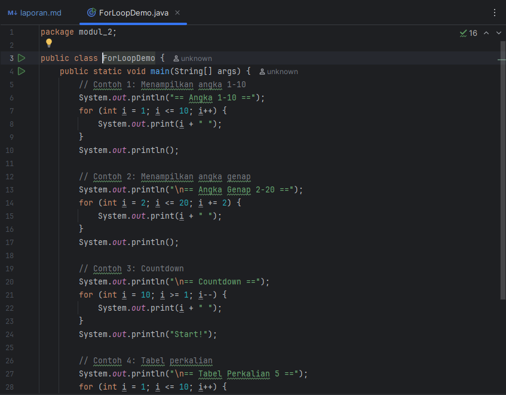
   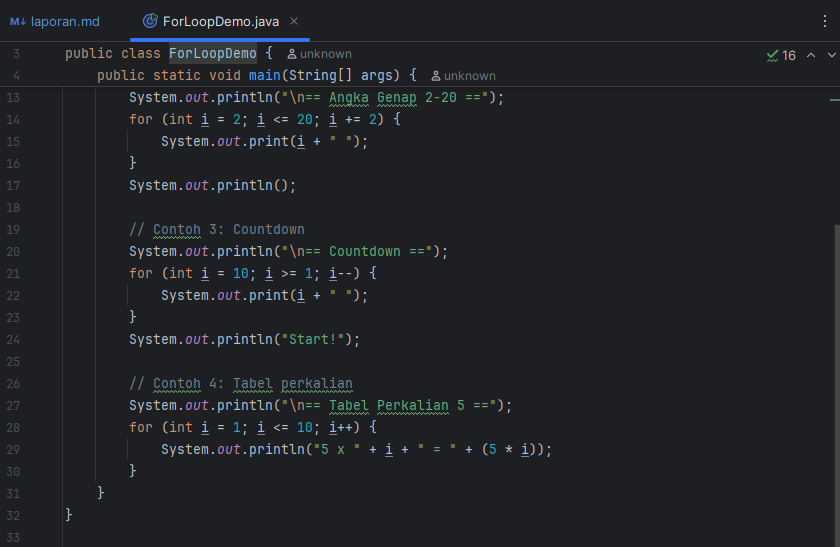
#### Screenshoot Hasil
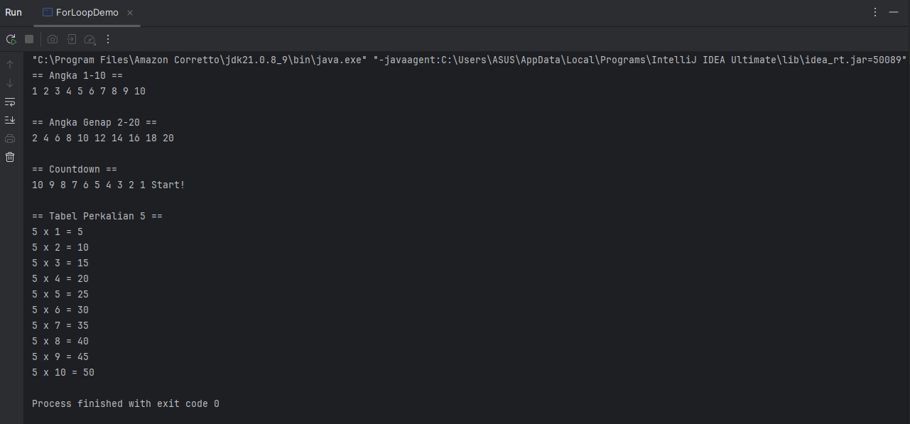
#### Analisa dan Pembahasan
Program ForLoopDemo adalah contoh implementasi perulangan for pada bahasa Java. Program ini berisi beberapa contoh penggunaan perulangan dengan logika yang berbeda-beda untuk menampilkan deret angka maupun perhitungan sederhana.

Penjelasan Bagian Program
Menampilkan angka 1–10
Program menggunakan perulangan for dari 1 hingga 10. Setiap iterasi menampilkan angka secara berurutan. Hasilnya adalah deret angka 1 sampai 10 yang dipisahkan oleh spasi.
Menampilkan angka genap 2–20
Perulangan dimulai dari angka 2 dan ditambah 2 setiap iterasi (i += 2). Dengan cara ini, hanya angka genap yang ditampilkan, mulai dari 2 hingga 20.
Countdown (Hitung Mundur)
Program menggunakan perulangan mundur, dimulai dari 10 dan berkurang 1 setiap iterasi hingga mencapai 1. Setelah perulangan selesai, program menampilkan kata "Start!" sebagai penanda akhir hitung mundur.
Tabel Perkalian 5
Program menggunakan perulangan for dari 1 hingga 10 untuk menampilkan hasil perkalian bilangan 5 dengan setiap angka. Output berupa tabel sederhana yang menunjukkan hasil perkalian 5 × 1 sampai 5 × 10.

Kelebihan Program
-Menampilkan berbagai variasi penggunaan perulangan for (naik, turun, melangkah lebih dari satu, dan operasi aritmatika).
-Struktur program sederhana dan mudah dipahami, sehingga cocok untuk pemula dalam mempelajari perulangan.
-Hasil output jelas dan bervariasi sehingga memperlihatkan fleksibilitas perulangan for.

Kekurangan Program
-Program hanya fokus pada contoh dengan angka tetap. Belum ada input dari pengguna sehingga hasilnya selalu sama setiap kali dijalankan.
-Tidak ada validasi atau kondisi dinamis, sehingga kurang interaktif.
-Hanya menunjukkan dasar penggunaan for tanpa kombinasi dengan logika lain, misalnya percabangan di dalam perulangan.

Kesimpulan
Program ForLoopDemo berhasil menunjukkan dasar penggunaan perulangan for dalam berbagai bentuk: perulangan maju, perulangan dengan kelipatan, perulangan mundur, serta perulangan untuk menampilkan tabel perkalian. Program ini sangat efektif untuk latihan memahami konsep iterasi dalam bahasa Java, meskipun masih bisa dikembangkan agar lebih interaktif dengan menambahkan input dari pengguna.

langkah 2 : perulangan while dan do-while
1. buatlah file baru dengan nama WhileLoopDemo.java
2. implementasikan contoh do-while
   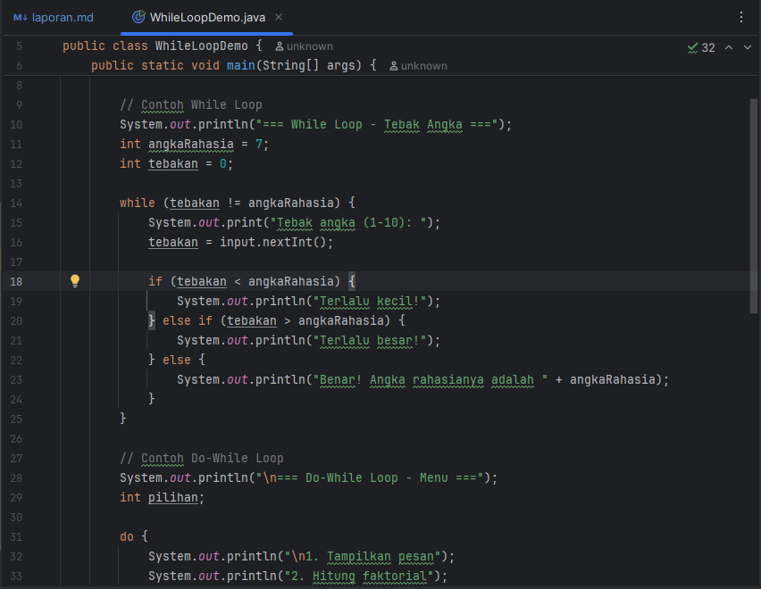
   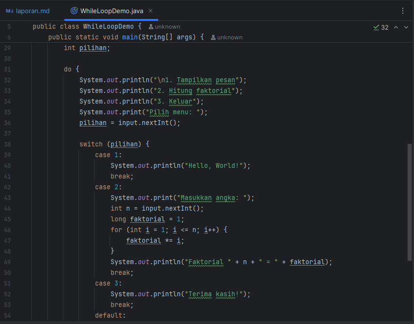
   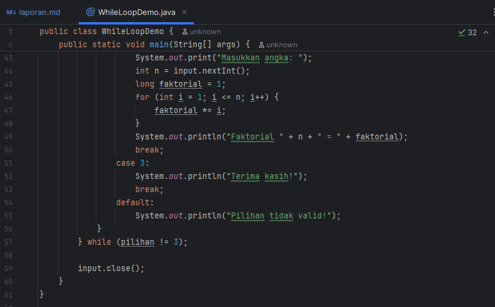
#### Screenshoot Hasil
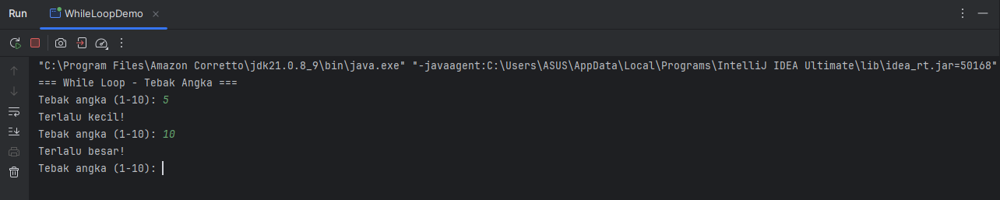
#### Analisa dan Pembahasan
Program WhileLoopDemo adalah contoh penerapan perulangan while dan do-while dalam bahasa Java. Program ini terdiri dari dua bagian utama: permainan tebak angka menggunakan while dan menu interaktif menggunakan do-while.
Bagian 1: While Loop – Tebak Angka
Pada bagian pertama, program menyimpan angka rahasia dengan nilai 7. Pengguna diminta menebak angka antara 1 sampai 10. Selama tebakan tidak sama dengan angka rahasia, perulangan while akan terus berjalan.
Jika tebakan lebih kecil dari angka rahasia, program menampilkan pesan “Terlalu kecil!”.
Jika tebakan lebih besar dari angka rahasia, program menampilkan pesan “Terlalu besar!”.
Jika tebakan sama, program menampilkan pesan “Benar!” dan perulangan berhenti.
Bagian ini menunjukkan bagaimana while digunakan untuk mengulang perintah sampai kondisi tertentu tercapai.

Bagian 2: Do-While Loop – Menu Interaktif
Setelah permainan tebak angka selesai, program menampilkan sebuah menu interaktif dengan tiga pilihan:
Menampilkan pesan sederhana “Hello, World!”.
Menghitung faktorial dari sebuah angka yang dimasukkan pengguna.
Keluar dari program.

Perulangan do-while memastikan menu akan selalu muncul minimal satu kali dan terus ditampilkan hingga pengguna memilih opsi keluar (pilihan 3).
Untuk menghitung faktorial, program menggunakan perulangan for dari 1 hingga n, lalu mengalikan hasilnya secara berulang.

Kelebihan Program
-Menggabungkan dua jenis perulangan (while dan do-while) dalam satu program sehingga jelas perbedaannya.
-Memberikan contoh nyata penggunaan perulangan: permainan sederhana dan menu interaktif.
-Menunjukkan kombinasi do-while dengan switch-case dan juga penggunaan for di dalamnya.
-Program interaktif dan tidak monoton karena pengguna bisa mencoba beberapa fitur.

Kekurangan Program
-Angka rahasia pada permainan tebak angka bersifat statis (selalu 7), sehingga permainan bisa cepat ditebak jika dijalankan berulang.
-Tidak ada validasi input, sehingga jika pengguna memasukkan nilai di luar ekspektasi (misalnya huruf), program akan error.
-Menu hanya berjalan dalam satu sesi dan belum menyimpan hasil perhitungan sebelumnya.

Kesimpulan
Program WhileLoopDemo berhasil memperlihatkan perbedaan antara while dan do-while. Perulangan while digunakan untuk permainan tebak angka yang berhenti saat kondisi benar tercapai, sedangkan do-while digunakan untuk menampilkan menu interaktif yang terus diulang sampai pengguna memilih keluar. Program ini efektif sebagai contoh pemahaman dasar perulangan dalam bahasa Java, meskipun masih bisa dikembangkan agar lebih dinamis dan interaktif.

---

## 3. Kesimpulan

Kesimpulan Praktikum Modul 2

Melalui praktikum ini, dapat disimpulkan bahwa dasar-dasar pemrograman Java mencakup pengenalan variabel, input-output, percabangan, serta perulangan.
Penggunaan Variabel dan Input-Output
Variabel digunakan untuk menyimpan data dengan tipe tertentu.
Scanner dimanfaatkan untuk membaca input dari pengguna, sedangkan System.out.println dan System.out.print digunakan untuk menampilkan output.

Struktur Percabangan
if-else digunakan untuk pengambilan keputusan sederhana.
if bersarang (nested if) dipakai untuk kondisi yang lebih kompleks.
switch-case mempermudah pemilihan kondisi yang bercabang banyak.

Struktur Perulangan
for digunakan untuk perulangan dengan jumlah iterasi yang sudah pasti.
while digunakan untuk perulangan dengan kondisi tertentu sampai tidak terpenuhi.
do-while memastikan perulangan berjalan minimal satu kali.
Perulangan bersarang (nested loop) bisa digunakan untuk kasus yang lebih kompleks, seperti tabel atau pola.

Implementasi Konsep
Program-program praktikum seperti perhitungan luas bangun datar, tebak angka, tabel perkalian, dan faktorial memperlihatkan penerapan nyata dari konsep dasar pemrograman.

Secara keseluruhan, praktikum ini memberikan pemahaman dasar tentang logika pemrograman dalam Java yang menjadi fondasi penting sebelum mempelajari konsep yang lebih lanjut, seperti array, fungsi, dan pemrograman berorientasi objek (OOP).

Saran Pengembangan

Validasi Input
Program dapat ditambahkan validasi agar input yang dimasukkan pengguna sesuai dengan yang diharapkan.
Misalnya pada program tebak angka, jika pengguna memasukkan angka di luar rentang 1–10, program bisa memberikan peringatan.

Penggunaan Fungsi/Method
Beberapa logika, seperti perhitungan faktorial atau penentuan kategori umur, bisa dipisahkan ke dalam method tersendiri.
Hal ini membuat program lebih modular, rapi, dan mudah dikelola.

Interaktivitas Lebih Lanjut
Tampilan output bisa dibuat lebih menarik dengan pemisah, menu yang lebih jelas, atau teks berwarna.
Pengguna bisa diberikan lebih banyak pilihan dalam menu.

Penerapan Konsep OOP
Ke depannya, logika program dapat diorganisir ke dalam class dan object sesuai konsep Object-Oriented Programming.
Contoh: membuat class Mahasiswa untuk program nilai, atau class Game untuk tebak angka.

Efisiensi dan Reusability
Program bisa menggunakan struktur perulangan dan method agar tidak terjadi pengulangan kode yang sama.
Dengan begitu, kode lebih ringkas dan mudah dibaca.

---

## 5. Referensi
Daftar Pustaka

Oracle. The Java™ Tutorials — Control Flow Statements.
https://docs.oracle.com/javase/tutorial/java/nutsandbolts/flow.html

Oracle. Class Scanner (Java Platform SE 8).
https://docs.oracle.com/javase/8/docs/api/java/util/Scanner.html

W3Schools. Java Loops.
https://www.w3schools.com/java/java_loops.asp

---