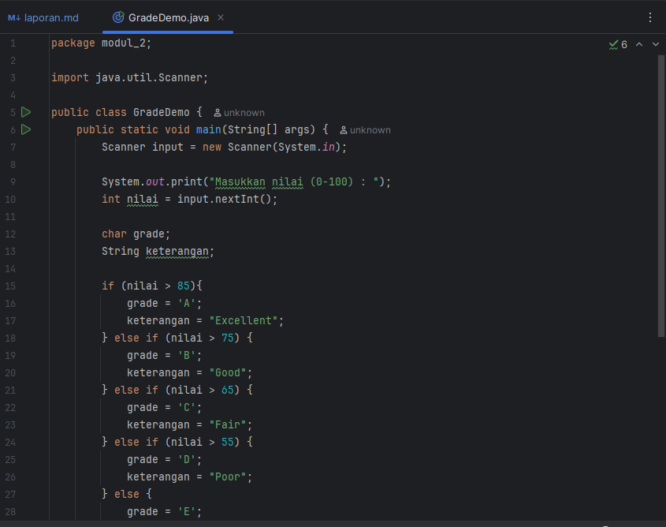

# Laporan Modul 2: Dasar Pemrograman Java
*Mata Kuliah:* Praktikum Pemrograman Berorientasi Objek   
*Nama:* [Siti Azzahra]  
*NIM:* [2024573010046]  
*Kelas:* [2E]

---

## 1. Abstrak
Laporan ini bertujuan untuk menyajikan hasil, analisis, dan pemahaman saya mengenai Dasar Pemrograman Java. Laporan praktikum ini menampilkan sejauh mana tingkat pemahaman saya terhadap Java, serta untuk mengetahui apakah saya benar-benar memahami materi praktikum ini melalui upaya mencoba dan menganalisisnya.

---
## 2. Praktikum
### Praktikum 1 - Dasar Pemrograman Java
#### Dasar Teori
Java adalah Bahasa Pemrograman yang sangat populer di seluruh dunia, ada jutaan Komputer Desktop yang dijalankan dengan java dan ada jutaan Handphone yang dijalankan oleh Java. Java mirip dengan Bahasa c++, yang dimana turunan langsung dari Bahasa C. banyak hal pada Java yang diwarisi dari dua Bahasa ini. Penciptaan Java berakar kuat pada proses penyempurnaan dan adaptasi yang telah terjadi dalam Bahasa pemrograman computer. Java begitu bagus dan kuat dikarenakan java tidak memakai compiler, java memakai interpreter, sehingga daripada menggunakan compiler yang menerjemahkan program sekaligus, java hanya menerjemahkan instruksi per instruksi yang sesuai dengan kebutuhan, sehingga java dapat berjalan pada semua jenis computer tanpa perlu di compile lagi.

#### Langkah Praktikum
Bahan yang harus disiapkan :
1.	Komputer
2.	IDE (Intellij, VsCode, Notepad++, DLL)
3.	Modul Praktikum 2 Dasar Pemrograman Java

Langkah Praktikum
1.	Buka IDE, saya memakai IntelliJ
2.	Buka Modul Praktikum Dasar Pemrograman Java
3.	Ketik dan Coba Syntaks yang terdapat pada Penjelasan
4.	Analisa kode yang di tulis
5.	Selesai

#### Screenshoot Hasil
Variabel Demo

Grade Demo

Input Output Demo

Menu Demo

Nested If Demo

Nested Loop Demo

For Loop Demo

While Loop Demo

#### Analisa dan Pembahasan
## a. VariabelDemo.java
Program ini menjelaskan penggunaan *variabel, **operasi aritmatika, dan **casting tipe data*.  
Terdapat operasi penjumlahan, pengurangan, perkalian, pembagian, modulus, serta casting dari double ke int.

## InputOutputDemo.java
Program ini membaca input pengguna dengan *Scanner* berupa nama, umur, dan tinggi, lalu menampilkan kembali data yang dimasukkan.

## GradeDemo.java
Program ini menggunakan *if else* untuk menentukan grade dari nilai yang dimasukkan.
- Jika nilai lebih dari 85 maka grade A.
- Jika nilai lebih dari 75 maka grade B.
- Jika nilai lebih dari 65 maka grade C.
- Jika nilai lebih dari 55 maka grade D.
- Jika tidak memenuhi maka grade E.

## MenuDemo.java
Program ini menampilkan *menu pilihan* dengan *switch case* untuk menghitung luas bangun datar:
- Luas persegi.
- Luas lingkaran.
- Luas segitiga.
- Keluar dari program.

## NestedIfDemo.java
Program ini menggunakan *if bersarang* untuk menentukan kategori umur:
- Bayi, Balita, Anak-anak, Remaja, Dewasa, dan Lansia.

## ForLoopDemo.java
Program ini menggunakan perulangan *for* untuk beberapa contoh:
- Menampilkan angka 1 sampai 10.
- Menampilkan bilangan genap 2 sampai 20.
- Melakukan countdown dari 10 sampai 1 lalu mencetak Start.
- Menampilkan tabel perkalian 5.

## WhileLoopDemo.java
Program ini menampilkan contoh penggunaan *while* dan *do while*:
- Game tebak angka menggunakan while.
- Menu pilihan dengan do while, termasuk perhitungan faktorial.

## NestedLoopDemo.java
Program ini menampilkan contoh *perulangan bersarang*:
- Membuat pola bintang segitiga.
- Menampilkan tabel perkalian 1-5.
- Membuat pola angka.

---

## 3. Kesimpulan
Dari seluruh program yang telah dibuat, dapat disimpulkan bahwa dasar-dasar pemrograman Java mencakup penggunaan variabel, operasi aritmatika, struktur percabangan, serta berbagai bentuk perulangan. Program yang sederhana seperti perhitungan nilai, pengelompokan umur, maupun perhitungan luas bangun datar sudah mampu menunjukkan bagaimana logika dasar bekerja di dalam kode. Selain itu, latihan dengan pola bintang, tabel perkalian, hingga game tebak angka membantu melatih pemahaman tentang kontrol alur dan penggunaan perulangan. Dengan menggabungkan semua konsep ini, pemula dapat memahami bagaimana Java mengelola input, memproses data, serta menampilkan output secara terstruktur. Program-program ini menjadi landasan penting untuk mempelajari konsep yang lebih lanjut seperti array, method, maupun pemrograman berorientasi objek.

## 4. Penutup
Praktikum ini memberikan pengalaman langsung dalam memahami dasar-dasar pemrograman menggunakan bahasa Java. Melalui latihan sederhana seperti penggunaan variabel, operasi aritmatika, input dan output, percabangan, serta perulangan, penulis dapat mengenal pola logika dasar dalam pemrograman. Dengan adanya praktik langsung, pemahaman teori menjadi lebih jelas karena setiap konsep dapat diuji dan dilihat hasilnya. Harapannya, dengan penguasaan dasar ini, penulis mampu mengembangkan keterampilan pemrograman lebih lanjut menuju materi yang lebih kompleks seperti array, method, dan pemrograman berorientasi objek.

---

## 5. Referensi
(Buku) Introduction to Programming Using Java
https://www.iitk.ac.in/esc101/share/downloads/javanotes5.pdf

(Buku) Java for Dummies
https://eprints.triatmamulya.ac.id/1702/1/Java%20for%20Dummies%20%286th%20ed.%29.pdf

(Buku) Java The Complete Reference Ninth Edition
https://www.sietk.org/downloads/javabook.pdf

---